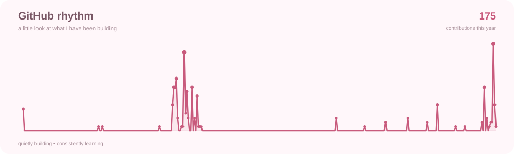

# 🎀 **Vanshika Suthar**

### `designer × developer × dreamer`

*I like building things that don't just work —*  
*they make you feel something.*

 

 

---

## ୨୧ A little about me

I'm a Computer Science student who somehow found herself equally fascinated by **logic and aesthetics**.

I enjoy taking an idea that exists only as a thought, a rough sketch, or a *"what if..."* — and turning it into something real.

I don't just ask:

> **"How do I build this?"**

I usually start with:

> **"Why should this exist?"**  
> **"Who is going to use it?"**  
> **"How should it feel?"**  
> **"And can I make it a little better?"**

I'm drawn towards the space where **technology meets creativity** — where clean architecture meets thoughtful design, and where a technically correct solution can still have a soul.

Currently exploring **full-stack development, DevOps, system thinking, UI/UX, creative technology and everything that makes me curious enough to stay awake at 2 AM.**

 

### ♡ The way I think

<pre>
curiosity
↓
observe
↓
question everything
↓
understand deeply
↓
build
↓
break it
↓
learn
↓
make it better
</pre>

I believe good developers solve problems.

**Great creators understand the problem first.**

---

## ✦ What I bring to a project

<table>
<tr>
<td width="50%" valign="top">

### ◌ Engineering

- Full-stack development
- REST API architecture
- Database design
- Authentication & authorization
- Cloud & deployment
- Automation
- Problem solving
- Debugging systems that *"should have worked"*

</td>

<td width="50%" valign="top">

### ◌ Creative thinking

- UI/UX & visual design
- Design systems
- Product thinking
- 3D & motion experiments
- Storytelling through interfaces
- Visual communication
- Turning complexity into simplicity
- Obsessing over tiny details

</td>
</tr>
</table>

---

## ♡ My toolkit

Instead of collecting technologies like trophies, I prefer to think of them as **different brushes for different problems.**

### `build`

### `create`

### `design`

### `data & cloud`

> *I know many tools. I'm still learning how to use them beautifully.*

---

## 𐙚 Things I'm learning to become

Not everything here is a finished skill.

Some are simply **directions I'm walking towards.**

|  | Focus | Progress | |
|:--|:--|:--|:--|
| ♡ | Full-Stack Development | 🎀🎀🎀🎀🎀🎀🎀🎀🎀♡ | building |
| ♡ | System Design | 🎀🎀🎀🎀🎀🎀🎀♡♡♡ | exploring |
| ♡ | DevOps & Cloud | 🎀🎀🎀🎀🎀🎀♡♡♡♡ | growing |
| ♡ | UI / UX | 🎀🎀🎀🎀🎀🎀🎀🎀🎀♡ | creating |
| ♡ | 3D / Motion | 🎀🎀🎀🎀🎀♡♡♡♡♡ | experimenting |
| ♡ | Product Thinking | 🎀🎀🎀🎀🎀🎀🎀🎀♡♡ | understanding |
| ♡ | Problem Solving | 🎀🎀🎀🎀🎀🎀🎀🎀🎀♡ | always learning |

---

## ✧ Things I love building

<table>
<tr>

<td align="center" width="33%">

### ◌ Products

Ideas → systems →  
something people can actually use.

</td>

<td align="center" width="33%">

### ◌ Interfaces

Because functionality  
doesn't have to look boring.

</td>

<td align="center" width="33%">

### ◌ Experiments

Small ideas, strange ideas,  
*"what if I tried this?"* ideas.

</td>

</tr>
</table>

---

## ♡ My GitHub garden

*Some people collect flowers.*  
*I apparently collect commits.*

<picture>
  <source media="(prefers-color-scheme: dark)" srcset="https://raw.githubusercontent.com/vanshikasas/vanshikasas/output/github-contribution-grid-snake-dark.svg">
  <source media="(prefers-color-scheme: light)" srcset="https://raw.githubusercontent.com/vanshikasas/vanshikasas/output/github-contribution-grid-snake.svg">
  
</picture>

 

🐍 A little snake eating my real contribution history.

---

## ✿ Recent GitHub rhythm

 

✿ a little visual diary of what I've been building

---

## ♡ The numbers behind the garden

 

Contribution data comes directly from GitHub. 

---

## ◌ A little more than code

<pre>
I notice details.

I ask questions.

I care about how people experience things.

I can spend hours understanding something
that someone else might call "just a small detail."

I don't always learn quickly.

But when I learn something,
I want to understand it deeply enough
to explain it, rebuild it, and make it mine.

I'm sensitive to things —
ideas, people, design, experiences.

And I don't think sensitivity and ambition
are opposites.

For me, it simply means:

feel deeply.
think clearly.
build boldly.
</pre>

---

## ✿ Currently

**learning** → systems, cloud, architecture & better engineering practices  
**building** → projects that combine technology + design  
**exploring** → creative development, 3D, motion & product ideas  
**looking for** → people who enjoy building, learning and questioning things  
**always** → curious

---

### `soft heart. sharp mind. curious hands.`

 

**Let's build something meaningful. ♡**

 

